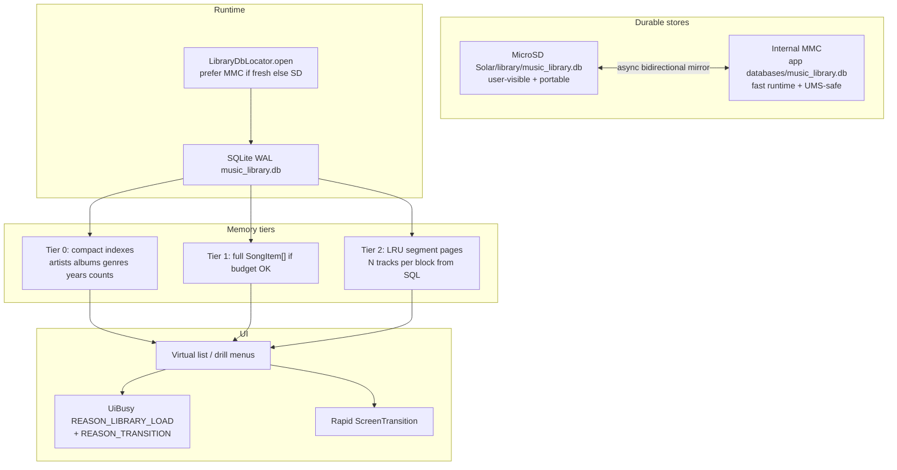

# Library DB on MicroSD + MMC mirror, RAM/segment cache, rapid transitions

## Goals

1. **Durable library index lives on user MicroSD** (Y1 soldered/slot TF as `sdcard0`, Y2 TF as `sdcard1`, etc.) **and is mirrored to internal MMC** so eject / UMS / dual-volume still work.
2. **Hot path is RAM-resident** when memory allows; otherwise **segment/block paging** from SQLite so large libraries stay snappy without OOM.
3. **Browse → select track → Now Playing** feels continuous: short transitions, status throbber whenever animation/work trails input.
4. **Transition animations are rapid**; never look frozen.

## Current baseline (code)

| Area | Today | Gap |
|------|--------|-----|
| DB file | `MusicLibraryStore` → `SolarDbHelper` → app-private only: `context.getDatabasePath("music_library.db")` under `/data/data/…/databases/` | **Not** on MicroSD; no MMC↔SD mirror |
| Scan | `LibraryScanner` + batch upsert; roots via `DeviceFeatures.getMusicRoots()` | Solid; still hydrates full list into RAM |
| In-memory | `MainActivity.customLibrary` = full `ArrayList<SongItem>` from `store.loadAll()` | One giant list; no memory budget / paging |
| Indexes | `LibraryCategoryIndex` (genre/year); Flow catalog caches | Good start; artist/album lists often rebuild on UI thread |
| Themes (precedent) | `ThemeManager.syncPublicThemesBidirectional` — **MMC load + MicroSD 1:1 mirror**, async, throttled | **Reuse this pattern for library DB** |
| Transitions | `ScreenTransition` PUSH 200 / PLAYER 220 / CROSSFADE 180; `UiBusy.REASON_TRANSITION` on coordinator | Can go snappier; `REASON_LIBRARY_LOAD` defined but barely wired |
| Throbbers | `UiBusy` + status `pb_status_loading` for search/track/Flow/seek/transition | Expand to library page binds + first open of large lists |

## Target architecture



---

## Workstream 1 — Library DB placement + MMC ↔ MicroSD mirror

### Paths (device-aware via `DeviceFeatures`)

| Role | Path |
|------|------|
| **MicroSD primary durable** | `{getMicroSdRoot()}/Solar/library/music_library.db` (mkdirs) |
| **MMC runtime / UMS-safe** | App `getDatabasePath("music_library.db")` (today’s location) — keep as open handle |
| **Optional peer** | Internal public volume `.solar/library/` only if MicroSD missing and internal is the only user volume |

Y1: MicroSD root is typically soldered `/storage/sdcard0`.  
Y2: MicroSD = `/storage/sdcard1`, internal peer `/storage/sdcard0`.  
A5: TF-first rules already in `DeviceFeatures`.

### Locator + open policy (`LibraryDbLocator` new)

1. **Runtime open order** (like themes, inverted for speed under UMS):
   - Prefer **MMC app DB** if file exists and `mtime >= MicroSD mtime` (or SD absent).
   - Else open **MicroSD** DB if present; schedule immediate MMC copy.
   - Else create empty schema on MMC, mirror to SD when writable.
2. **After every successful scan / batch upsert / favorites write**: mark dirty → **async mirror** MicroSD ↔ MMC (throttled, e.g. min 15–30s between full copies; always mirror on scan complete).
3. **Boot / storage mount**: one background reconcile (pick newer by mtime+size; copy winner → loser).
4. **UMS export**: treat like themes — **never block wheel**; if SD is exported, keep serving MMC; re-sync when volume returns.
5. **Corrupt recovery**: existing `SolarDbHelper` rename-to-`.corrupt.*` + recreate; then pull other mirror if healthy.

### Implementation touch points

- Extend `SolarDbHelper` **or** MusicLibraryStore constructor to accept optional absolute path via `SQLiteOpenHelper(Context, name, factory, version)` **with** `context.getDatabasePath` override:
  - Cleanest: open via `SQLiteDatabase.openOrCreateDatabase(File, null)` wrapper while keeping `SolarDatabase` pragmas (WAL, synchronous=NORMAL).
- New: `app/.../library/LibraryDbLocator.java`, `LibraryDbMirror.java` (copy WAL-safe: checkpoint then file copy of db + `-wal`/`-shm` or `VACUUM INTO` / backup API).
- Prefer **WAL checkpoint + single-file copy** under exclusive brief lock so mirrors stay consistent.
- `SolarDataReset` / clear cache: wipe **both** locations.
- Unit tests: locator picks newer; mirror does not run on UI thread (contract tests with temp files).

### Migration

On first boot after feature:

1. If only MMC app DB exists → copy to MicroSD Solar/library/.
2. If only MicroSD exists → copy to MMC.
3. If both → newer wins, mirror to other.
4. Keep using same schema (`tracks`, favorites, audiobook bookmarks) — no schema break required.

---

## Workstream 2 — RAM residency + segment paging

### Problem

`store.loadAll()` → `customLibrary` holds **every** track as `SongItem` forever. Fine for small/medium libraries; painful on large collections or low free heap on Y1/Y2.

### Memory policy (`LibraryMemoryBudget` new)

```
heapBudget = min( maxMemory * 0.18, 48MB )   // tunable
estimateFull = trackCount * BYTES_PER_SONG_ITEM  // ~256–400B measured
if estimateFull <= heapBudget && freeMemory headroom OK:
    mode = FULL_RESIDENT
else:
    mode = SEGMENTED
```

Re-evaluate after scan and on low-memory trim (`onTrimMemory`).

### Tier 0 — always in RAM (compact)

Rebuild once per `libraryScanGen` (extend `LibraryCategoryIndex` or new `LibraryNavIndex`):

- Sorted artist names  
- Album keys (artist\0album)  
- Genre / year lists (already)  
- Counts for list subtitles  
- Optional: first-letter section index for wheel jump  

**No full paths** for every track until needed.

### Tier 1 — FULL_RESIDENT

Current behavior: `loadAll` → `customLibrary`. Keep as fast path for typical libraries.

### Tier 2 — SEGMENTED (when over budget)

- Keep `customLibrary` empty or as optional warm set; browse uses **query pages**:
  - `loadTracksByArtist(artist, offset, limit)`
  - `loadTracksByAlbum(...)`
  - `loadAllPathsWindow(offset, limit)` for Songs list
- `LibrarySegmentCache`: LRU of blocks (e.g. **256–512 tracks/block**, cap **8–16 blocks** in RAM).
- Virtual song `ListView` / adapters request blocks by index range; bind only visible rows (already partially virtualized).
- Playback queue: when user picks a track, resolve **playlist segment** (album or “all songs” window around index) into concrete `File` list without loading entire library.

### SQL helpers (MusicLibraryStore)

Add indexed queries (indexes if missing):

- `idx_tracks_artist_album_track` on `(artist, album, track_number, title)`
- `idx_tracks_album_artist`
- Paginated `query(..., LIMIT/OFFSET)` or keyset pagination by path for stability

Avoid full table scans on every menu open.

### MainActivity integration (ponytail-sized)

1. Introduce `LibrarySession` facade: `artists()`, `albums(artist)`, `songs(...)`, `songAt(...)`.
2. Route existing browse builders through facade (artists/albums/songs first; playlists/favorites second).
3. Keep `customLibrary` as compatibility shim: FULL mode fills it; SEGMENTED mode methods that still expect full list either:
   - build temporary lists for small result sets only, or  
   - migrate call sites (grep `customLibrary`) in phases.

---

## Workstream 3 — Rapid transitions + status throbbers

### Animation timings (faster iPod feel)

| Constant | Current | Target |
|----------|---------|--------|
| `PUSH_MS` | 200 | **150–160** |
| `PLAYER_MS` | 220 | **170–180** |
| `CROSSFADE_MS` | 180 | **140** |
| `MODAL_MS` | 170 | **140** |

Only after verifying no visual glitch on 60/30 Hz Y1/Y2 panels. Prefer LUT ease already in place.

### Main-thread rules during transitions

1. `ScreenTransitionCoordinator.run`: already arms `UiBusy.REASON_TRANSITION`.
2. **Do not** rebuild full artist/song lists mid-outgoing animation when destination is heavy:
   - Show destination root immediately (empty or previous gen).
   - `UiBusy.begin(REASON_LIBRARY_LOAD)` → fill list after first frame / on anim complete.
3. Wire `REASON_LIBRARY_LOAD` on:
   - First open Artists / Albums / Songs / folder with large bind  
   - Segment cache miss filling a page  
   - Cache hydrate from DB on cold start  
4. Clear busy when adapter has data + focus restored.
5. Keep spinner **non-focusable** (A5 DPAD rule).

### Browse path optimizations (same PR train)

- Prefer adapter/`notifyDataSetChanged` / virtual window over `removeAllViews()` (existing delightful-UI rule).
- Subtitle cache (`rebuildSongListSubtitleCache`) only for visible window in SEGMENTED mode.
- Defer album-art thumbnail decode off critical path (already async for scan art).

---

## Implementation phases

| Phase | Deliverable | Done when |
|-------|-------------|-----------|
| **L0** | Plan mirrored to `.agents/` + `.cursor/plans/` | Agents can find it |
| **L1** | `LibraryDbLocator` + MMC↔MicroSD mirror + migrate existing DB | DB files exist on SD + MMC; scan/write survives reboot; UMS still serves MMC |
| **L2** | Store query APIs + indexes + `LibraryMemoryBudget` | Unit tests for budget + page queries |
| **L3** | SEGMENTED browse for Songs/Artists/Albums | Large lib does not OOM; wheel stays 1:1 |
| **L4** | Faster transitions + `REASON_LIBRARY_LOAD` on all heavy menus | Status spinner on laggy drills; anim feels snappier |
| **L5** | Device smoke Y1/Y2/A5 | 10k+ track lib if available; SD eject; UMS; select→play |

Phases L1 and L4 can parallelize (different files: db/mirror vs MainActivity transitions). L2→L3 sequential.

---

## Multi-agent split (optional)

| Owner | Work |
|-------|------|
| **Grok** | L1 locator/mirror + SolarDbHelper path open; L4 transitions/throbbers |
| **Cursor** | L2–L3 segmented cache + MusicLibraryStore queries + browse facade |
| **Antigravity** | Device smoke scripts; UMS/SD eject matrix; perf logs |

One hop only; partition files to avoid conflicting edits on `MainActivity.java` (serialize browse migration).

---

## Testing

| Test | Method |
|------|--------|
| Unit | Locator newer-wins; budget FULL vs SEGMENTED thresholds; page LIMIT SQL on in-memory DB |
| Unit | Mirror copy after upsert (temp dirs) |
| Device Y1/Y2 | Confirm files: MicroSD `Solar/library/music_library.db` + app databases; sizes match after scan |
| Device | Eject SD (Y2) / UMS lock — library still opens from MMC |
| Device | Large library: open Songs, scroll, select track → NP; status throbber only when work lags |
| Device | Transition Artists→Albums→Songs feels rapid; no blank freeze without spinner |

Commands: JDK 17 Gradle unit tests; adb install per project MUSTS; optional `ScanPerfLog` + transition perf session logs.

---

## Risks / reversals

| Risk | Mitigation |
|------|------------|
| Copying WAL DB mid-write corrupts mirror | Checkpoint + brief write lock; or backup API; never copy on UI thread |
| Dual open handles | Single process singleton `MusicLibraryStore`; mirror is file-level offline copy |
| SEGMENTED breaks callers of full `customLibrary` | Compatibility shim; migrate hot paths first; feature flag `library_segmented` default auto |
| MicroSD slow → laggy writes | Write MMC first, async mirror to SD (still “stored on SD” as durable peer within seconds) |
| Faster anims feel abrupt | Tune constants; keep mechanical LUT ease |

Comment style: timestamped narrative (layman + technical) on non-obvious blocks.

---

## Key file index

```
app/src/main/java/com/solar/launcher/MusicLibraryStore.java
app/src/main/java/com/solar/launcher/LibraryScanner.java
app/src/main/java/com/solar/launcher/db/SolarDbHelper.java
app/src/main/java/com/solar/launcher/DeviceFeatures.java
app/src/main/java/com/solar/launcher/MainActivity.java   # customLibrary, scan, browse
app/src/main/java/com/solar/launcher/LibraryCategoryIndex.java
app/src/main/java/com/solar/launcher/theme/ThemeManager.java  # mirror precedent
app/src/main/java/com/solar/launcher/ui/UiBusy.java
app/src/main/java/com/solar/launcher/ui/ScreenTransition.java
app/src/main/java/com/solar/launcher/ui/ScreenTransitionCoordinator.java
app/src/main/java/com/solar/launcher/SolarDataReset.java
NEW: library/LibraryDbLocator.java
NEW: library/LibraryDbMirror.java
NEW: library/LibraryMemoryBudget.java
NEW: library/LibrarySegmentCache.java
NEW: library/LibrarySession.java   # facade optional
```

---

## Out of scope (unless blocking)

- Changing on-disk music file layout (Music/ folders stay)
- Full RoomDB / Room migration
- Cloud library sync
- Redesigning Flow carousel (only library feed speed)

---

## Relation to prior lag/volume work

Uncommitted work already covers UiBusy throbbers, clear-queue silence, YT pending seek, Hearing Safety volume. This plan **adds** library durability + memory architecture and **tightens** transition/library loading. Do not regress those fixes while landing L1–L4.

---

## Approach 3 deferred (2026-07-19)

Approach 2 (lock/mtime/policy index, Back dismiss, Stem→home) ships first and must be proven on a 300+ track device before this plan’s segmented/paged RAM work.

**Do not start Approach 3 until Approach 2 is verified.** Then:

- Default toward `LibraryMemoryBudget.SEGMENTED` / paged catalog so full `customLibrary` is not always resident
- Async album/artist index bake with UI placeholders only
- Explicit context Back stack machine (tier IDs) instead of focus-zone heuristics
