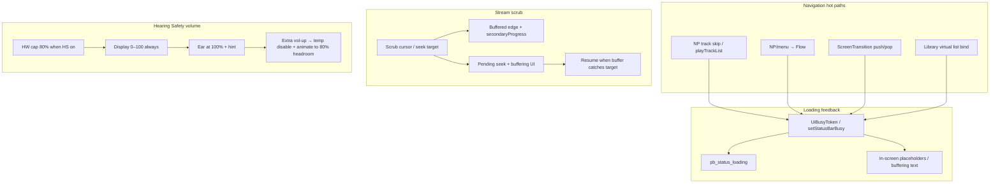

# Solar lag, loading feedback, YouTube scrub, Hearing Safety volume

**Canonical workspace copy (for Cursor IDE):**  
`.cursor/plans/solar_lag_loading_volume_youtube_scrub.plan.md`

Also mirrored:  
`.agents/plan-solar-lag-loading-volume-youtube-scrub.md`

## Progress (2026-07-18 — Grok continued)

| Phase | Status | Notes |
|-------|--------|-------|
| **0** Mirror plan | **done** | This file + `.agents/` copy |
| **1** UiBusy + status throbber | **done (wired)** | `UiBusy`; search + track_change + flow_open + seek_buffer + **menu transition** (`ScreenTransitionCoordinator`) |
| **2** Hearing Safety volume | **done (app + overlay + context)** | Temp unlock + ear + 0–100 on NP/video/context modal/quick bar/overlay; Xposed temp prop |
| **3** YT / stream pending seek | **MVP done** | Video pending seek; **audio NP** scrub past buffer + secondary progress + UiBusy |
| **4** NP/Flow/menu/library perf | **partial** | Throbbers on hot paths; snappier `ScreenTransition` timings; deep jank profiling still open |
| **Clear Queue bug** | **fixed** | Was mediaPlayer-only → unstoppable YT IJK / podcast / radio; now full engine stop |

### Remaining / device smoke
1. **Library scroll / menu transition** main-thread bind cost (B3/B4) — profile + defer rebuilds.
2. **NP track-to-track** — patch-only metadata updates vs full `updatePlayerUI` where safe.
3. Device smoke on Y1/Y2: HS ear unlock, YT scrub past buffer, Flow open throbber, Clear Queue silence.
4. Overlay companion ear *icon* on ChipContextMenu (display math already 0–100).

### Key files touched
- `app/.../ui/UiBusy.java` (new)
- `app/.../MainActivity.java` — throbber, track/flow busy, volume ear/unlock
- `app/.../HearingSafetyVolume.java` — temp unlock, PROP_TEMP_UNLOCK
- `app/.../media/MediaTransportBar.java` — ear + unlock animation
- `app/.../media/MediaSuiteHost.java` — pending video seek + buffer UI
- `solar-overlay-ui/.../OverlayVolumeDisplay.java` (new), `ChipOverlayHost.java`
- `solar-rom/.../VolumePanelHooks.java` — temp unlock in HearingSafetyStub
- strings: `hearing_safety_volume_ear_hint`, `hearing_safety_unlock_hint`, `stream_seek_buffering`
- tests: `UiBusyTest`, `HearingSafetyVolumeTest` (+temp remap), `OverlayVolumeDisplayTest`

---

## Goals

1. **Feel faster** on the hot navigation paths the user listed (NP track change, NP→Flow, menu→Flow, library scroll, menu push/pop).
2. **Never look frozen** — when work still takes time, show status-bar / in-UI loading throbbers so waits feel intentional.
3. **YouTube (and stream) scrub past buffer** — allow the seek; show buffering progress; resume at the target when data arrives.
4. **Hearing Safety volume UX** — 80% hardware cap maps to a full 100% bar; ear cue + extra volume-up temporarily unlocks full range with a smooth re-scale animation; default remains **opted out**.

---

## Current baseline (from code)

| Area | What exists | Gap |
|------|-------------|-----|
| Status throbber | `pb_status_loading` + `syncStatusBarSearchThrobber()` / `isStatusBarSearchLoading()` in `MainActivity` | Only search-like work (Get Music, Soulseek, podcasts search, remote library search, Deezer, YT browse). **Not** transitions, track switches, Flow handoff, library page loads, seek-buffering. |
| Menu transitions | `ScreenTransition` (`PUSH_MS=200`, `PLAYER_MS=220`, `CROSSFADE_MS=180`), hardware layers, LUT ease | Stutter often from **main-thread work during anim** (list rebuild, art decode, catalog), not only duration. |
| NP ↔ Flow | `FlowScreenTransition`, `NpToFlowMorphPolicy`, cover bake caches | Heavy art / catalog work can hitch the crossfade. |
| Library scroll | Virtual lists + `FocusScrollHelper` (instant selection); prior wheel lag from debug loggers (fixed 2026-07-16) | Remaining jank likely bind cost, thumb decode, full rebuilds. |
| Podcast/Reach scrub | `playbackMaxSeekMs()` clamps to downloaded edge | **Hard clamp** — user cannot target past buffer. |
| Video/YT scrub | `MediaSuiteHost` clamps to **duration only**; `VideoPlayerController.seekTo` fire-and-forget; buffering UI mainly pre-start | Seek past buffered region looks stuck; no secondary buffer bar / pending-seek wait UI. |
| Hearing Safety core | `HearingSafetyVolume` maps cap index → display 100%; default **off** | Correct math in app NP/video pulse. |
| Volume overlays | `ChipOverlayHost` / companion uses **raw** `AudioManager.getStreamMaxVolume/getStreamVolume` | Indicators stall ~80% of bar when OS or HS caps index — **primary volume-display bug**. Missing ear + temporary unlock animation. |

---

## Architecture (target)



---

## Workstreams

### A — Status-bar busy / loading throbbers (broaden existing spinner)

**Files (primary):**
- `app/src/main/java/com/solar/launcher/MainActivity.java` — `pbStatusLoading`, `syncStatusBarSearchThrobber`, `isStatusBarSearchLoading`
- `app/src/main/res/layout/activity_main.xml` — `pb_status_loading`
- Possibly small helper: `app/src/main/java/com/solar/launcher/ui/UiBusy.java` (refcount + reasons)

**Design:**
- Generalize search-only throbber into a **refcount busy model**:
  - `UiBusy.begin(reason)` / `end(reason)` (or generation token).
  - Reasons: `search`, `transition`, `flow_open`, `track_change`, `library_load`, `seek_buffer`, `youtube_resolve`, …
- `syncStatusBarSearchThrobber()` → `syncStatusBarLoadingThrobber()`: show spinner when any busy count > 0 (except pure home clock if product prefers quiet home).
- Keep existing search flags; fold them into the same helper so one place owns visibility + theme tint.
- **Never focusable** (already enforced for A5 DPAD).

**Where to arm/disarm (minimum set from user scenarios):**
1. NP track change / `playTrackList` / media skip until new metadata + decoder ready enough to paint.
2. NP → Flow and menu → Flow until Flow catalog/first frame ready (or animation end + first paint).
3. Menu push/pop when destination builds async lists (library roots, large folders).
4. Library scan / first page of tracks binding.
5. YouTube resolve + post-seek buffering (ties to workstream C).

**Acceptance:** On Y1/Y2, every multi-hundred-ms wait listed by the user shows the status spinner (or equivalent local buffering copy) until the destination is interactive.

---

### B — Lag / stutter fixes (core performance)

Prioritize **root causes** over shorter animation constants alone.

#### B1 — Now Playing track-to-track
**Suspect:** full UI rebuild, art decode on main thread, decoder restart blocking input.
**Approach:**
- Profile `playTrackList` / skip path: defer non-critical work past first frame (title/progress first, art async via existing album-art pipeline).
- Avoid full `refreshPlayerUi`-class rebuilds on every skip; patch changed fields only.
- Show status throbber from skip until playhead/title stable.

#### B2 — NP → Flow / menu → Flow
**Files:** `flow/FlowScreenTransition.java`, `flow/FlowScreenHost.java`, `flow/FlowCatalog*.java`, `flow/CoverLoadGovernor.java`, `NpToFlowMorphPolicy.java`, MainActivity Flow entry.
**Approach:**
- Start transition immediately; load/bake covers under governor (already partially present).
- Do not block animation start on full catalog rebuild if session cache warm.
- Throbber from leave-source until Flow accepts wheel.
- Kill leftover agent logs on Flow transition path if any still allocate on main (`DebugB8b871Log` etc. only when `ENABLED`).

#### B3 — Menu screen transitions
**Files:** `ui/ScreenTransition.java`, `ui/ScreenBackdropTransition.java`, MainActivity `changeScreen`.
**Approach:**
- Ensure list construction for *incoming* screen does not run mid-frame of outgoing anim when avoidable (prepare next frame / post after `animating` clears for heavy rebuilds).
- Prefer adapter/virtual list updates over `removeAllViews()` full rebuilds (existing delightful-UI rule).
- Only after jank measured: consider snappier timings (e.g. push 200→160) without sacrificing iPod feel.

#### B4 — Library scroll
**Files:** virtual song list adapters, browser bind paths, thumbnail loaders, `FocusScrollHelper`.
**Approach:**
- Keep instant `setSelection` (no smoothScroll stack on wheel).
- Bound per-tick work: recycle rows, cap simultaneous decode, cancel offscreen.
- Re-run wheel perf script `scripts/test_menu_wheel_perf_adb.sh` if present; confirm no hot-path debug I/O.

**Acceptance:** Wheel tracks 1:1 on library lists; NP skip and Flow open feel continuous; frame gaps during transitions reduced (qualitative device + optional `TransitionPerfLog` session).

---

### C — YouTube / stream scrub past buffer

**Problem:** User cannot usefully scrub/fast-forward past buffered content; interaction feels locked.

**Files:**
- `media/MediaSuiteHost.java` — video scrub, `seekVideoMs`, `commitVideoScrub`, buffering listener
- `video/VideoPlayerController.java` — `seekTo`, `onBufferingUpdate`
- `media/MediaTransportBar.java` — progress UI (add secondary buffer if ProgressBar supports it)
- `MainActivity.java` — audio scrub path `playbackMaxSeekMs` / `seekMediaTo` for YT audio / growing streams
- `net/SolarStreamProxy.java` — Range JIT streaming (already intended for scrub)

**Design (graceful catch-up):**
1. **Separate “cursor target” from “playable edge”.**
   - Scrub cursor may move across full duration.
   - Buffered edge from `onBufferingUpdate(percent)` (and/or proxy/cache bytes when applicable).
2. **On commit (or live hold-seek):**
   - If target ≤ buffered edge → `seekTo` immediately.
   - If target > buffered edge → accept target as **pending seek**, show buffering UI (status throbber + transport text / secondary progress filling toward target), keep decoder alive.
3. When buffer ≥ pending target (or player reports seek complete / ready), apply seek and clear pending; resume play.
4. **Secondary progress** on transport ProgressBar = buffered fraction (where API allows); primary = playhead or scrub cursor.
5. Do **not** silently clamp to buffer in a way that makes the control feel stuck; if a temporary clamp is needed for broken engines, still show “Buffering to mm:ss…”.
6. Apply same pattern where practical to **YouTube audio** on music IJK and other HTTP streams (podcasts/Reach already clamp — upgrade to pending-seek UX rather than hard stop).

**Acceptance:**
- Scrub past buffer on YT video is allowed.
- UI shows buffering progress and catches up to chosen position.
- No frozen transport without feedback for >~300ms after seek past buffer.

---

### D — Hearing Safety volume display + temporary unlock

**Desired product behavior:**
- Default: **Hearing Safety off** (already `PREF_ENABLED` default false).
- When **on**: real loudness capped at **80% HW**; bar always paints **0–100** of allowed range (100% = cap).
- At display max with HS on: **ear symbol** + short hint to keep scrolling right / press volume up (Y2 wheel + keys; A5 volume keys only) to **temporarily disable** Hearing Safety.
- On temporary disable: smooth animation — bar/current level re-maps so current loudness shows as **~80%**, ear fades, headroom above 80% opens.
- Applies to **all** Solar volume surfaces: NP transport pulse, video transport, context modal volume, overlay/companion volume HUD, Xposed-routed volume panel → Solar overlay.

**Files:**
- `HearingSafetyVolume.java` — cap, display map, temp-disable session flag
- `MediaVolumeControl.java` — adjust + display API
- `MainActivity.java` — `adjustVolume`, transport pulse
- `media/MediaTransportBar.java` — volume pulse UI + ear/hint
- `OverlayModalHost.java` / context volume slider (already uses display 0–100)
- `solar-overlay-ui/.../ChipOverlayHost.java` — **fix raw AM max/cur** → display 0–100 + ear
- `global-context-modal/...` if it duplicates volume UI
- `solar-rom/.../VolumePanelHooks.java` / `HearingSafetyStub` — respect temp unlock prop
- Layout/drawables for ear icon; strings for hint
- Tests: `HearingSafetyVolumeTest.java`, overlay mapping tests if any

**Logic sketch:**
```
if (HS_on && !tempUnlocked && atEffectiveMax && user presses volume up):
    setTempUnlocked(true)  // session or until user re-enables / leaves media? prefer session + clear on reboot
    // current HW index stays; effectiveMax becomes absoluteMax
    // display animates from 100 → ~80 (same loudness, new scale)
    fade out ear
else:
    normal step with display mapping
```

- Persist temp unlock in memory (+ optional `persist.solar.hearing_safety.temp=0/1` for Xposed) so companion overlay and AudioService hooks agree.
- Permanent HS remains settings toggle; temp unlock does not rewrite user preference unless product later wants “remember”.

**Fix volume-only-reaches-80% bug:**
1. Companion/overlay paths must use `getMediaDisplayVolume` / max 100, never raw stream max as bar max.
2. When OS safe-media still limits while HS is off, keep using `ensureFullVolumeRange` (already present); verify overlay still paints full bar after unlock.
3. NP path already comments “0–100 display” — audit every `showSlider` / `showVolumePulse` call site.

**Acceptance:**
- HS off: bar reaches true 100% HW.
- HS on: bar reaches 100% at cap; ear + hint at max; extra vol-up unlocks with smooth re-scale to ~80% + headroom.
- Overlay + modal + transport all agree.

---

## Implementation phases

| Phase | Scope | Done when |
|-------|--------|-----------|
| **0** | Mirror this plan into `.cursor/plans/` + `.agents/` | Cursor IDE can open plan from Solar workspace |
| **1** | UiBusy + status throbber generalization | Throbber appears on transition/track/library/seek waits |
| **2** | Hearing Safety volume display + ear + temp unlock + overlay fix | Volume bars never “stuck at 80%” incorrectly; ear unlock works |
| **3** | YouTube/stream pending seek + buffer UI | Scrub past buffer with feedback |
| **4** | NP skip / Flow / menu / library perf passes | Qualitative lag scenarios improved on device |

Phases 2 and 3 can run in parallel after Phase 1 scaffolding if multi-agent split is used.

---

## Multi-agent split (optional)

| Owner | Work |
|-------|------|
| **Grok** | Phase 0–1 (UiBusy + wire hot paths); Phase 2 app-side volume/ear |
| **Cursor** | Phase 3 video/YT pending seek + transport secondary progress; overlay volume display |
| **Antigravity** | Phase 4 Flow/NP skip profiling + library scroll bind audit; ROM hook temp-unlock prop if needed |

Handoffs must be self-contained (`AGENTS.md` one-hop rule). No concurrent edits to the same files.

---

## Testing matrix

| Device | Case |
|--------|------|
| Y1/Y2 | NP next/prev track lag + throbber |
| Y1/Y2 | NP → Flow, menu → Flow |
| Y1/Y2 | Library long list wheel scroll |
| Y1/Y2 | Menu push/pop depth 2–3 |
| Y1/Y2 | YT video scrub past buffer mid-stream |
| Y1/Y2 | YT audio NP scrub past buffer if applicable |
| Y1/Y2 + A5 | Volume bar HS off → 100% |
| Y1/Y2 + A5 | HS on → 100% at cap, ear, extra vol-up unlock animation |
| Any | Companion/global overlay volume matches in-app display |
| Unit | `HearingSafetyVolumeTest` extended for temp unlock mapping; scrub util for pending target |

Commands (from repo root, existing project conventions): unit tests via Gradle; device smoke via adb install of staged Solar APK per `.cursor/rules` build MUSTS.

---

## Out of scope (unless discovered as blockers)

- Redesigning Flow carousel UX
- New volume hardware curves beyond 80% cap
- Replacing IJK/MediaPlayer engines wholesale
- Companion APK architecture rewrite (only volume display mapping + props)

---

## Risks / reversals

| Risk | Mitigation |
|------|------------|
| Throbber overuse on home clock | Gate by screen state; short minimum show time |
| Pending seek never completes on bad stream | Timeout + toast + cancel pending; stay playable at edge |
| Temp HS unlock forgotten “loud” | Session-only default; toast when unlocking; ear gone is the cue |
| Overlay/process display mismatch | Shared math + props; tests for display mapping |
| Animation jank from more layers | Hardware layer only during anim (existing pattern) |

Comment style: timestamped narrative comments (layman + tech) per project rules; no large refactors without ponytail-sized steps.

---

## Key file index

```
app/src/main/java/com/solar/launcher/MainActivity.java
app/src/main/java/com/solar/launcher/HearingSafetyVolume.java
app/src/main/java/com/solar/launcher/MediaVolumeControl.java
app/src/main/java/com/solar/launcher/media/MediaSuiteHost.java
app/src/main/java/com/solar/launcher/media/MediaTransportBar.java
app/src/main/java/com/solar/launcher/video/VideoPlayerController.java
app/src/main/java/com/solar/launcher/ui/ScreenTransition.java
app/src/main/java/com/solar/launcher/flow/FlowScreenTransition.java
app/src/main/java/com/solar/launcher/flow/FlowScreenHost.java
app/src/main/java/com/solar/launcher/net/SolarStreamProxy.java
app/src/main/res/layout/activity_main.xml
solar-overlay-ui/.../ChipOverlayHost.java
solar-rom/vendor/xposed/solar-context-bridge/src/VolumePanelHooks.java
app/src/test/java/com/solar/launcher/HearingSafetyVolumeTest.java
app/src/test/java/com/solar/launcher/ScrubUtilTest.java
```

---

## Cursor IDE access

On approval / start of execution:

1. Write this plan to  
   `.cursor/plans/solar_lag_loading_volume_youtube_scrub.plan.md`  
   (Cursor Plans UI + workspace search).
2. Write a short pointer or full copy to  
   `.agents/plan-solar-lag-loading-volume-youtube-scrub.md`  
   (Antigravity / multi-agent discovery).
3. Keep Grok session `plan.md` in sync if the plan is revised.

No secrets in the plan. Follow `AGENTS.md`, ponytail, Y1/Y2 parity, and adb staging rules during implementation.
